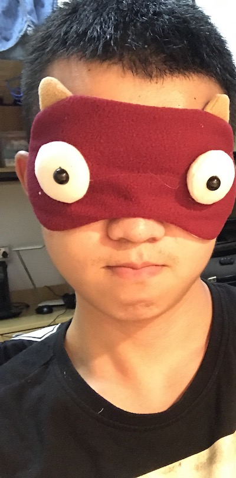

## 社联短信
原本抽中表情包，准备好两张自杀原图，得知是表情包 COS ……

>img0

 
> img1

`程序员从零计数`
 

所以果断拒绝现场模仿，故事时间。

我来自

`高考难度 = -1`

的福建省。从厦门一所

`count(["北清复交"]) = 0`

的二流高中意外考来我大土木还是欢天喜地的，于是怀着满心期待，开学初以上 Harvard CS50 时候体验的欢乐气氛的高标准（还是对国内大学质量假装太自信了）在新生周寻觅类似的欢乐，虽然现在对年轻时候对未来的美好向往感到愚蠢，在当时还是不免感受不小落差。

>img2

在同济，第一节大机课盯着老师一指禅输入`同济大学`四字耗时40s目瞪口呆，看见社联招新尚能有一丝安慰，甚至对社联的向往曾经成为一个周五夜晚对大学规划迷茫时候的心灵救赎，想这就是能成就我对专业感极高的期待的欢乐聚集地吧。报名面试后仍旧用那种新生周幻想的高标准仰视社联高大形象，然后整理一些高中时摄影集作为 Portfolio 参加了社联面试（敬畏）。

现在看来以目前媒体的新闻摄影水平我能过面试应该没啥问题，当时还感觉肩负社联沉沉的专业的重量感。

最令人兴奋的是新生晚会的摄影吧。超过半个暑假离开相机，借有主舞台的摄影任务的机会重拾相机，简直有如重新拾起灵魂，开学之初思念摄影不输思念ex。我享受彩排摄影的那一天。除去摄影本身，社联简直还是集体约饭最佳选择。

虽然媒体专业水平不及最初的期望，社联的欢乐早已胜过一切。是它助我结识了最初的一群朋友，顺利适应大学全新的环境，我已经感激不尽。

**对社联和自己的四年生活献上最美好的祝福。**

[彩蛋0]()